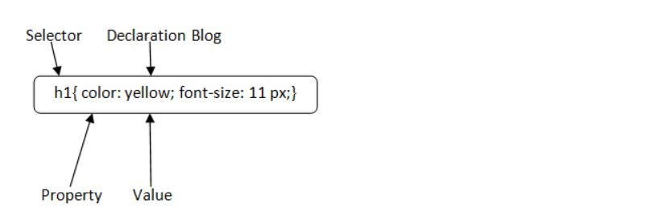

# CSS_Documentation
## What is CSS?
**CSS** stands for Cascading Style Sheets. Which is used to describe the look and formatting of a document written in markup language, **CSS** allows you to apply styles to web pages.
### CSS Syntax
A **CSS** rule set contains a selector and a declaration block.


* **Selector:** Selector indicates the HTML element you want to style. 
* **DeclarationBlock:** The declaration block can contain one or more declarations separated by a semicolon.
* **Property:** A Property is a type of attribute of HTML element. It could be color, border etc.
* **Value:** Values are assigned to CSS properties. In the above example, value "yellow" is assigned to color property.
### CSS Selectors
* **CSS selectors** are used to select the content you want to style. 
* **CSS selectors** select HTML elements according to its **id, class, type, attribute** etc.


There are several different types of selectors in CSS.

1. **CSS Element Selector**
1. **CSS Id Selector**
1. **CSS Class Selector**
1. **CSS Universal Selector**
1. **CSS Group Selector**

1) CSS Element Selector
The element selector selects the HTML element by name.

```
<!DOCTYPE html>  
<html>  
<head>  
<style>  
p{  
    text-align: center;  
    color: green;  
}   
</style>  
</head>  
<body>  
<p>Welcome to APSSDC</p>  
<p id="para1">Gov of Andhra Pradesh</p>  
<p>Vijayawada!</p>  
</body>  
</html> 
```
