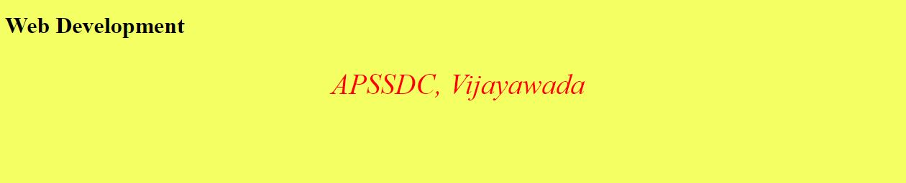
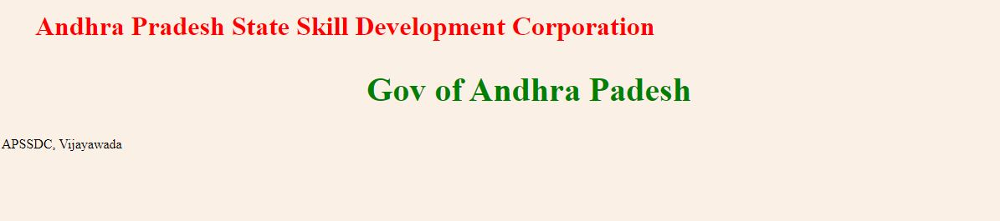
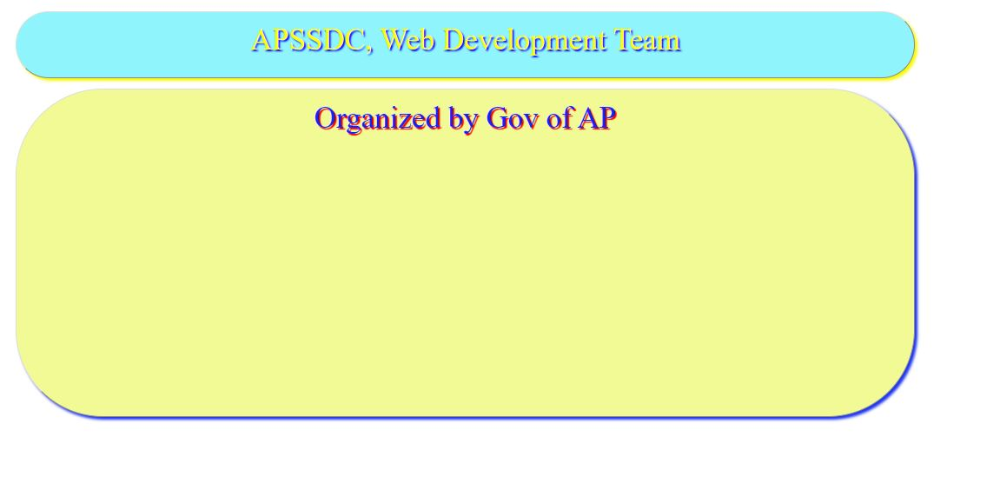

# CSS_Documentation
## What is CSS?
**CSS** stands for Cascading Style Sheets. Which is used to describe the look and formatting of a document written in markup language, **CSS** allows you to apply styles to web pages.
### CSS Syntax
A **CSS** rule set contains a selector and a declaration block.
___


* **Selector:** Selector indicates the HTML element you want to style. 
* **DeclarationBlock:** The declaration block can contain one or more declarations separated by a semicolon.
* **Property:** A Property is a type of attribute of HTML element. It could be color, border etc.
* **Value:** Values are assigned to CSS properties. In the above example, value "yellow" is assigned to color property.

### CSS Selectors

* **CSS selectors** are used to select the content you want to style. 
* **CSS selectors** select HTML elements according to its **id, class, type, attribute** etc.


There are several different types of selectors in CSS.

1. **CSS Element Selector**
1. **CSS Id Selector**
1. **CSS Class Selector**
1. **CSS Universal Selector**
1. **CSS Group Selector**

**1. CSS Element Selector**

* The element selector selects the HTML element by name.

```
<!DOCTYPE html>  
<html>  
<head>  
<style>  
p{  
    text-align: center;  
    color: green;
    font-size: 35px;
}   
</style>  
</head>  
<body>  
<p>Welcome to APSSDC</p>  
<p id="para1">Gov of Andhra Pradesh</p>  
<p>Vijayawada!</p>  
</body>  
</html> 
```
### Output:
____


**2. CSS Id Selector**

The **id selector** selects the id attribute of an HTML element to select a specific element. And it is chosen to select a single, **unique** element.

* It is written with the hash character (#)
```
<!DOCTYPE html>  
<html>  
<head>  
<style>  
#para1 {  
    text-align: center;  
    color: red;
    font-size: 40px;
}  
</style>  
</head>  
<body>  
<p id="para1">Hello EveryOne..!</p>  
<p>Welcome to Frontend CSS Class.</p>  
</body>  
</html>
```
### Output:
___


3. **CSS Class Selector**

The class selector selects HTML elements with a specific class attribute. It is used with a period character . (full stop symbol) followed by the class name.

**Note:A class name should not be started with a number.**
```
<!DOCTYPE html>  
<html>  
<head>  
<style>  
.center {  
    text-align: center;  
    color: orange;
    font-size: 35px;
    font-style: bold;

}  
</style>  
</head>  
<body>  
<h1 class="center">Andhra Pradesh State Skill Development Corporation</h1>  
<p class="center">Gov of Andhra Pradesh</p>   
</body>  
</html>  
```
### Output:
___


4. **CSS Universal Selector**

The universal selector is used as a wildcard character. It selects all the elements on the pages.

```
<!DOCTYPE html>  
<html>  
<head>  
<style>  
* {  
    text-align: left;  
    color: red;
    font-size: 35px;
    font-style: bold;

}  
</style>  
</head>  
<body>  
<h1 class="center">Andhra Pradesh State Skill Development Corporation</h1>  
<p class="center">Gov of Andhra Pradesh</p>   
</body>  
</html>
```
### Output:
___


## 5. CSS Group Selector

The grouping selector is used to select all the elements with the same style definitions.

* Grouping selector is used to minimize the code. 
* Commas are used to separate each selector in grouping

```
h1 {  
    text-align: center;  
    color: green;
    font-style: bold;
     background: #AAFA54
     
}  
h2 {  
    text-align: center;  
    color: green;
    font-style: bold;
     background: #AAFA54
}  
p {  
    text-align: center;  
    color: green;
    font-style: bold;
     background: #AAFA54
} 
``` 
**Example Program**
```
<!DOCTYPE html>  
<html>  
<head>  
<style>  
h1, h2, p,body {  
    text-align: center;  
    color: blue;
    font-style: bold;
    background: #AAFA54;
}  
</style>  
</head>  
<body>  
<h1>Hello EveryOne</h1>  
<h2>Welcome to CSS Class</h2>  
<p>This Program is offerd by the gov of Andhra Pradesh</p>  
</body>  
</html>
```

### Output:
___


## Kinds of CSS

There are three ways to insert CSS in HTML documents.

* Inline CSS
* Internal CSS (or) Embedded CSS
* External CSS

## 1. Inline CSS

**Inline CSS** is used to apply **CSS** on a single line or element.

**Example:**

```
<body style="background: #F3FF62 ">
<p style = "color:red; font-size:40px; 
            font-style:italic; text-align:center;"> 
            APSSDC, Vijayawada
        </p> 
```
**Example Program**
```
<!DOCTYPE html> 
<html> 
    <head> 
        <title>Inline CSS</title> 
    </head> 
      
    <body style="background: #F3FF62 "> 
    <h1 >Web Development</h1> 
    <p style = "color:red; font-size:40px; 
            font-style:italic; text-align:center;"> 
            APSSDC, Vijayawada
        </p>  
    </body> 
</html>     
```
### Output:
___


## 2.Internal CSS (or) Embedded CSS

The internal style sheet is used to add a unique style for a single document. It is defined in **head** section of the HTML page inside the **style** tag.

**Example**

```
<!DOCTYPE html>
<html>
<head>
	<style>
			body {
			  background-color: linen;
			}

			h1 {
			  color: red;
			  margin-left: 40px;
			}
			#vis{
			  color: green;
			  text-align: center;
			  font-size:40px;

			}

	</style>
</head>
<body>

	<h1>Andhra Pradesh State Skill Development Corporation</h1>
	<h2 id='vis'>Gov of Andhra Padesh</h2>
	<p>APSSDC, Vijayawada</p>


</body>
</html>
```

### Output:
___



## External CSS

**External CSS:** External CSS contains separate CSS file which contains only style property with the help of tag attributes (For example class, id, heading, … etc). 

* The external .css file should not contain any HTML tags.


**Example:**

Here is how the **styles.css** file looks like

```
body {
    background-color:skyblue;
}
.sdc {
    text-align:center;   
}
.APSSDC {
    color:orange;
    font-size:50px;
    font-weight:bold;
}
#vis {
    font-style:bold;
    font-size:30px;
}
```

* CSS property written in a separate file with .css extension and should be linked to the HTML document using link tag.

```
<!DOCTYPE html> 
<html> 
    <head> 
        <link rel="stylesheet" href="styles.css"/> 
    </head> 
  
    <body> 
        <div class = "sdc"> 
            <div class ="APSSDC">Web Development Team</div> 
            <div id ="vis"> 
                APSSDC,Vijayawada
            </div> 
        </div> 
    </body> 
</html> 
```
### Output:
___


## Various Kinds of Properties along with values

The Some of properties is given below.

* This css code is writen in .css file ex:**styles.css**
```
.c{
	color: yellow;
	width: 80%;
	border: 1px outset #ddd;
	padding: 1%;
	margin: 1%;
	text-align: center;
	box-shadow: 3px 3px 3px  #F7FA08 ;
	border-radius: 100px;
	text-shadow: 2px 2px 2px blue;
	height: 50px;
	background:#90F4FC;
	font-style: bold;
	font-size: 35px;

}
#vis{
	color: #0C26FB ;
	width: 80%;
	border: 1px outset #ddd;
	padding: 1%;
	margin: 1%;
	background: #F1FA95;
	text-align: center;
	box-shadow: 3px 3px 3px  #1C33F3  ;
	border-radius: 100px;
	text-shadow: 2px 2px 1px red ;
	height: 350px;
	font-style: bold;
	font-size: 35px;

}
```

**Example Program**
```
<!DOCTYPE html> 
<html> 
    <head> 
        <link rel="stylesheet" href="css/styles.css"/> 
    </head> 
  
    <body> 
        
            <div class ="c">APSSDC, Web Development Team</div> 
            <div id ="vis"> Organized by Gov of AP</div>
        
    </body> 
</html> 
```

### Output:
___



