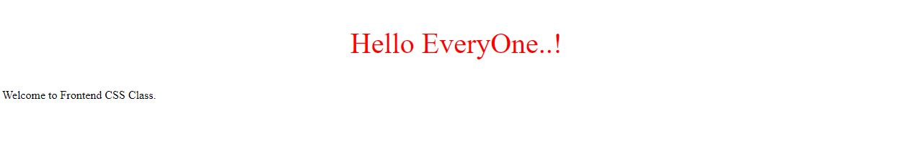
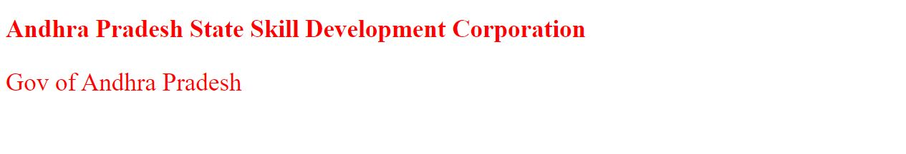

# CSS_Documentation
## What is CSS?
**CSS** stands for Cascading Style Sheets. Which is used to describe the look and formatting of a document written in markup language, **CSS** allows you to apply styles to web pages.
### CSS Syntax
A **CSS** rule set contains a selector and a declaration block.
___


* **Selector:** Selector indicates the HTML element you want to style. 
* **DeclarationBlock:** The declaration block can contain one or more declarations separated by a semicolon.
* **Property:** A Property is a type of attribute of HTML element. It could be color, border etc.
* **Value:** Values are assigned to CSS properties. In the above example, value "yellow" is assigned to color property.
### CSS Selectors
* **CSS selectors** are used to select the content you want to style. 
* **CSS selectors** select HTML elements according to its **id, class, type, attribute** etc.


There are several different types of selectors in CSS.

1. **CSS Element Selector**
1. **CSS Id Selector**
1. **CSS Class Selector**
1. **CSS Universal Selector**
1. **CSS Group Selector**

**1. CSS Element Selector**
* The element selector selects the HTML element by name.

```
<!DOCTYPE html>  
<html>  
<head>  
<style>  
p{  
    text-align: center;  
    color: green;
    font-size: 35px;
}   
</style>  
</head>  
<body>  
<p>Welcome to APSSDC</p>  
<p id="para1">Gov of Andhra Pradesh</p>  
<p>Vijayawada!</p>  
</body>  
</html> 
```
### Output:
____


**2. CSS Id Selector**
The **id selector** selects the id attribute of an HTML element to select a specific element. And it is chosen to select a single, **unique** element.

* It is written with the hash character (#)
```
<!DOCTYPE html>  
<html>  
<head>  
<style>  
#para1 {  
    text-align: center;  
    color: red;
    font-size: 40px;
}  
</style>  
</head>  
<body>  
<p id="para1">Hello EveryOne..!</p>  
<p>Welcome to Frontend CSS Class.</p>  
</body>  
</html>
```
### Output:
___



3. **CSS Class Selector**
The class selector selects HTML elements with a specific class attribute. It is used with a period character . (full stop symbol) followed by the class name.

**Note:A class name should not be started with a number.**
```
<!DOCTYPE html>  
<html>  
<head>  
<style>  
.center {  
    text-align: center;  
    color: orange;
    font-size: 35px;
    font-style: bold;

}  
</style>  
</head>  
<body>  
<h1 class="center">Andhra Pradesh State Skill Development Corporation</h1>  
<p class="center">Gov of Andhra Pradesh</p>   
</body>  
</html>  
```
### Output:
___


4. **CSS Universal Selector**
The universal selector is used as a wildcard character. It selects all the elements on the pages.

```
<!DOCTYPE html>  
<html>  
<head>  
<style>  
* {  
    text-align: left;  
    color: red;
    font-size: 35px;
    font-style: bold;

}  
</style>  
</head>  
<body>  
<h1 class="center">Andhra Pradesh State Skill Development Corporation</h1>  
<p class="center">Gov of Andhra Pradesh</p>   
</body>  
</html>
```
### Output:
___



5. **The CSS Universal Selector**
* The universal selector **(*)** selects all HTML elements on the page.

    * Let's see the CSS code without group selector.

```
h1 {  
    text-align: center;  
    color: green;
    font-style: bold; 
}  
h2 {  
    text-align: center;  
    color: green;
    font-style: bold; 
}  
p {  
    text-align: center;  
    color: green;
    font-style: bold;
} 
``` 

```<!DOCTYPE html>  
<html>  
<head>  
<style>  
h1, h2, p {  
    text-align: center;  
    color: green;
    font-style: bold;
}  
</style>  
</head>  
<body>  
<h1>Hello EveryOne</h1>  
<h2>Welcome to CSS Class</h2>  
<p>This Program is offerd by the gov of Andhra Pradesh</p>  
</body>  
</html>
```
### Output:
___

